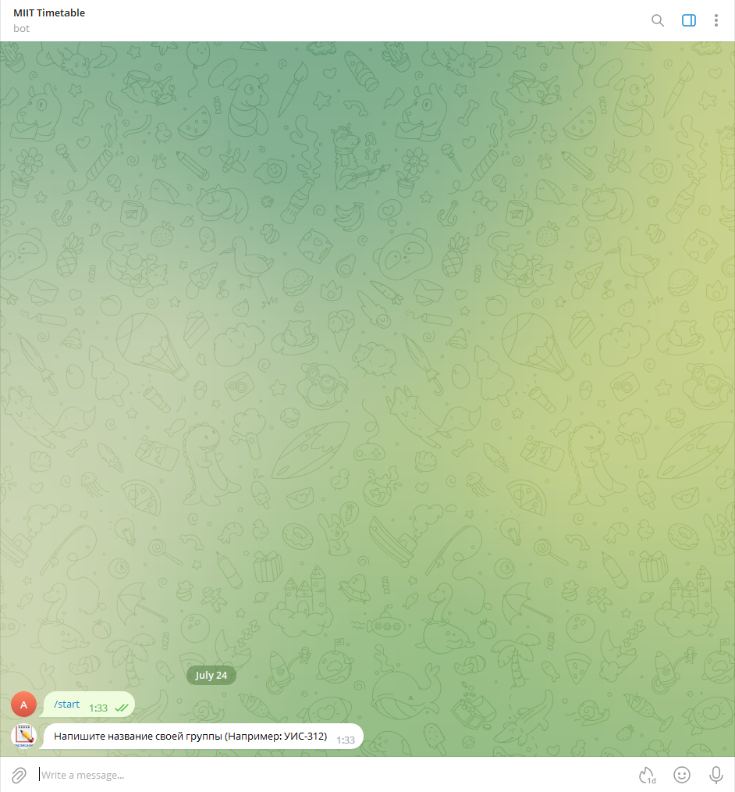
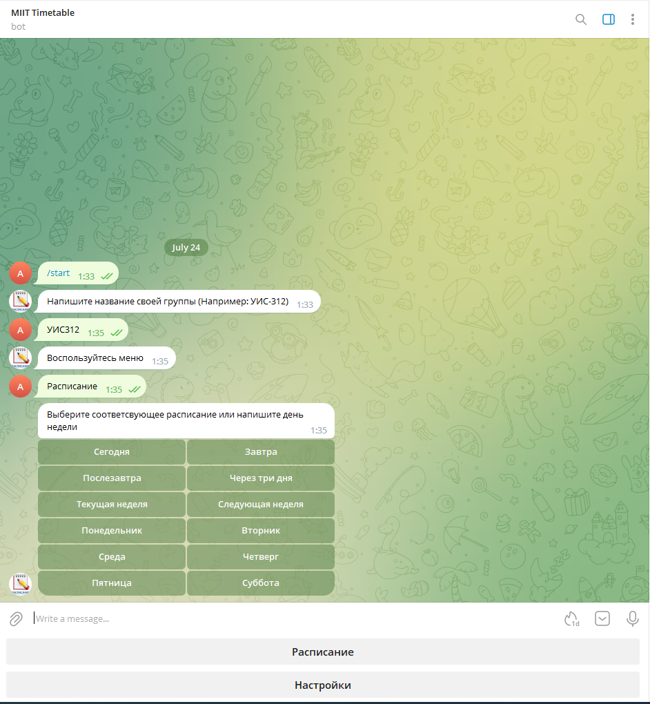
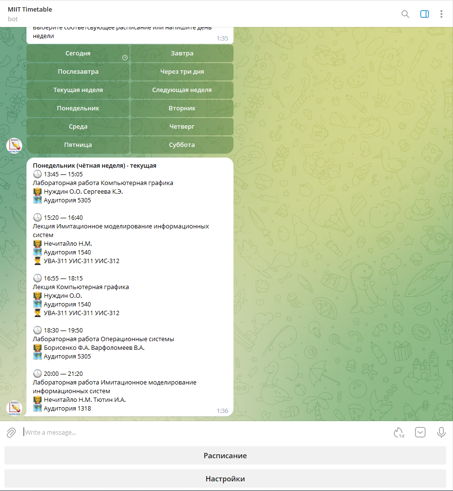
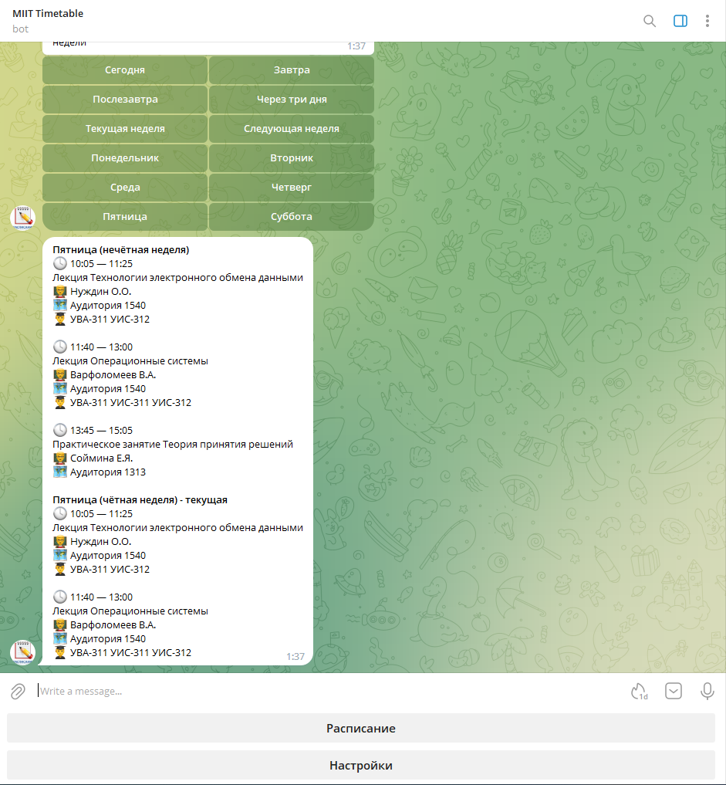
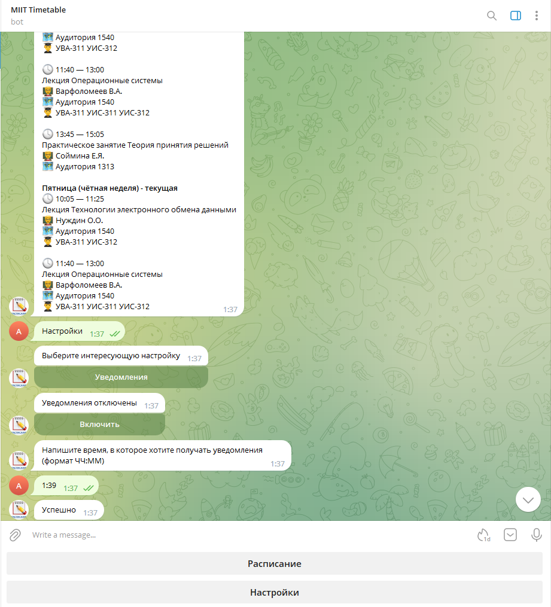
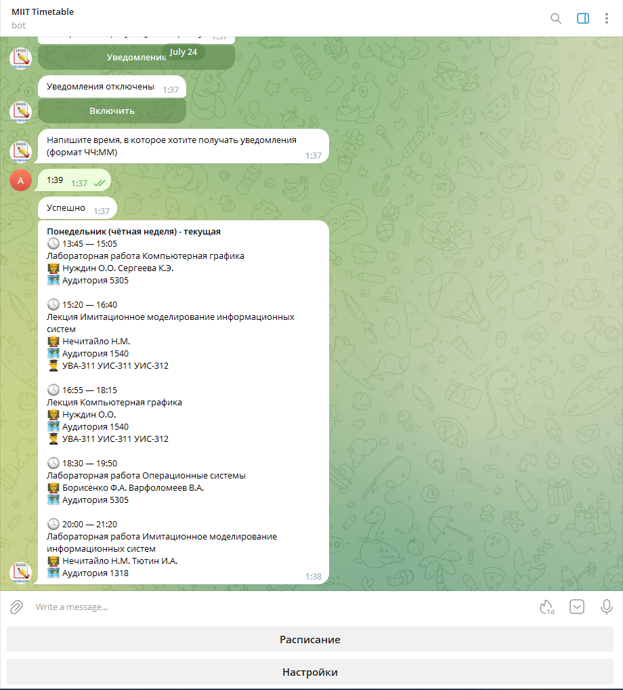
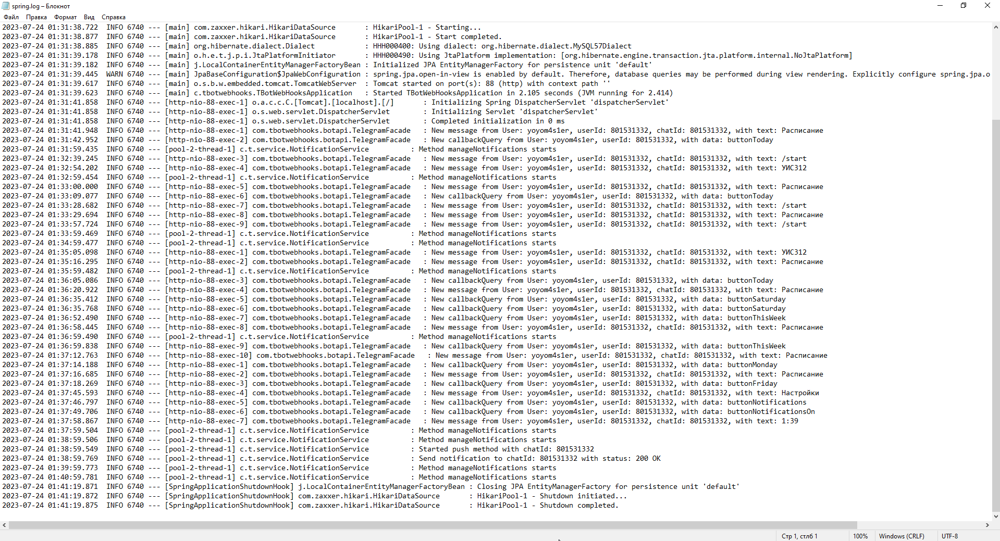
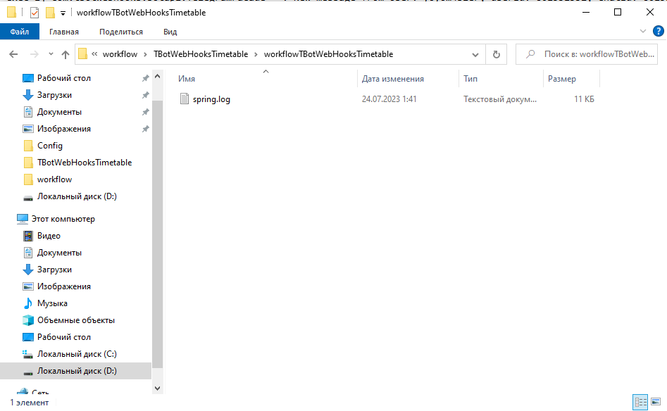

# Телеграм-бот на Java Spring
Данный проект представляет интеракивное расписание групп университета. Получение информации происходит путем парсинга [сайта университета](https://www.miit.ru/timetable). Взаимодействие с Telegram API происходит через Webhook.

## Стек технологий
- Spring Boot
- Spring Data
- Mysql
- Lombok
- Jsoup
## Как это выглядит

**Нажимаю на кнопку "Сегодня"**

**Возможность настроить уведомления**

## Логирование
**Все запросы к приложению логируются и сохраняются на локальном компьютере.**

